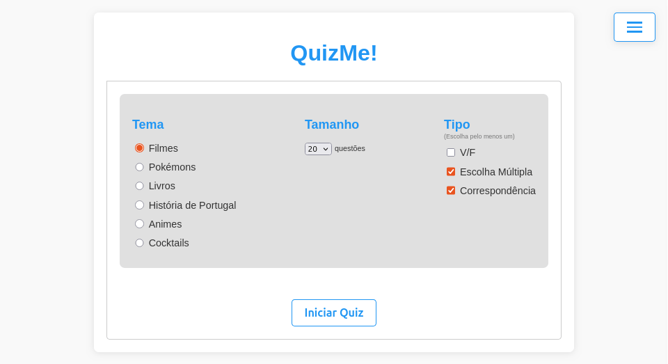

# Gerador de Quizzes

### Aceda aqui (Online): https://quiz-generator-mim4.onrender.com (pode demorar um pouco a abrir inicialmente)



## Descrição
Este projeto foi desenvolvido no âmbito da unidade curricular de **Representação e Processamento de Conhecimento na Web** do Mestrado em Engenharia Informática da Universidade do Minho.

Este consiste numa aplicação web que gera quizzes baseados em diferentes ontologias. Os quizzes são dinâmicos e incluem diferentes tipos de questões. Clique [aqui](docs/ListaQuestoes.md) para aceder à lista de templates utilizadas para as questões.

Queries SPARQL são pré-realizadas através dos scripts `queries[Tema].py`. Os resultados das queries são armazenados em ficheiros JSON, que são utilizados durante o fluxo da aplicação para gerar as questões. Este processo elimina a necessidade de realizar queries em tempo real, tornando o sistema não dependente de endpoints externos.

## Funcionalidades

- **Seleção de Tema**:
  - "Filmes"
  - "Pokémons"
  - "Livros"
  - "História de Portugal"
  - "Animes"
  - "Cocktails"
- **Seleção do Tamanho do Quiz**: O utilizador pode escolher um número diferente de questões (10, 15, 20, 25 ou 30).
- **Seleção de Tipo (Escolher pelo menos um)**:
  - V/F
  - Escolha Múltipla
  - Correspondência

## Estrutura do Projeto

```
├── app.py                        # Ficheiro principal que gere o fluxo e lógica da aplicação
├── gen_questions.py              # Script para gerar e distribuir questões do quiz
├── Procfile                      # Configuração para deploy online
├── requirements.txt              # Dependências do projeto
│
├── web_templates/                # Ficheiros HTML para as páginas da aplicação
│   ├── home.html                 # Página inicial para seleção de tema, tamanho e tipos
│   ├── choiceQs.html             # Página para questões de V/F e Escolha Múltipla
│   ├── matchQs.html              # Página para questões de Correspondência
│   ├── result.html               # Página de resultado após cada questão
│   └── end.html                  # Página de pontuação final
│
├── temas/                        # Scripts para geração de questões por tema
│   ├── gen[Tema].py              # Funções para gerar questões sobre cada tema (genFilmes.py, ...)
│   ├── query_utils.py            # Funções auxiliares para execução de queries SPARQL
│   ├── queries[Tema].py          # Scripts para executar queries sobre cada ontologia (queriesFilmes.py, ...)
│   └── query_results/            # Ficheiros JSON com os resultados das queries SPARQL
│       └── [Tema][TipoQ][N].json # Resultados para templates de questões (FilmesTF1.json, ...)
│
├── ontologias/                   # Ontologias e scripts relacionados
│   ├── [Tema].rdf/ttl            # Ontologias para cada tema (FilmesTop500.ttl, ...)
│   └── [tema]Aux/                # Pastas com scripts/datasets para criar/povoar temas (filmesAux/, ...)
|
├── docs/                         # Documentação
│   ├── home.png                  # Screenshot da página inicial
│   └── ListaQuestoes.md          # Documentação com os templates de questões para cada tema
```

## Como Executar (Localmente)

1. Certifique-se de que tem o Python instalado.
2. Instale as dependências necessárias:
   ```bash
   pip install flask flask-cors rdflib
   ```
3. Inicie a aplicação:
   ```bash
   python app.py
   ```
4. Aceda à aplicação no seu browser em `http://127.0.0.1:3000`.

## Notas Importantes

As ontologias **Filmes**, **Pokémons** e **Livros** foram desenvolvidas por nós a partir de APIs e datasets disponíveis online, nomeadamente:

- [Movie Database API ̣̣(TMDb)](https://www.themoviedb.org/)
- [Pokémon Dataset (Kaggle)](https://www.kaggle.com/datasets/rounakbanik/pokemon)
- [Livros Dataset (Kaggle)](https://www.kaggle.com/datasets/pooriamst/best-books-ever-dataset)

Enquanto que as ontologias **História de Portugal**, **Animes** e **Cocktails** foram originalmente criadas por alunos de anos anteriores.

Para tornar a aplicação acessível online, utilizámos o serviço **[Render](https://render.com/)**, que permitiu fazer o deploy e hosting da aplicação de forma gratuita. Pode aceder à aplicação [aqui](https://quiz-generator-mim4.onrender.com/)


## Equipa

- **Tomás Campinho**
- **Maria Cunha**
- **Lingyun Zhu**